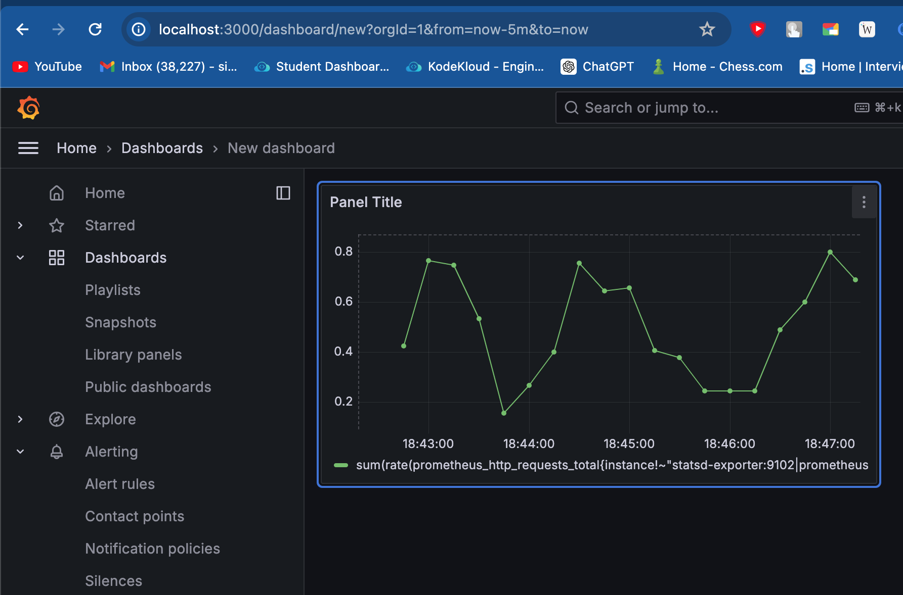
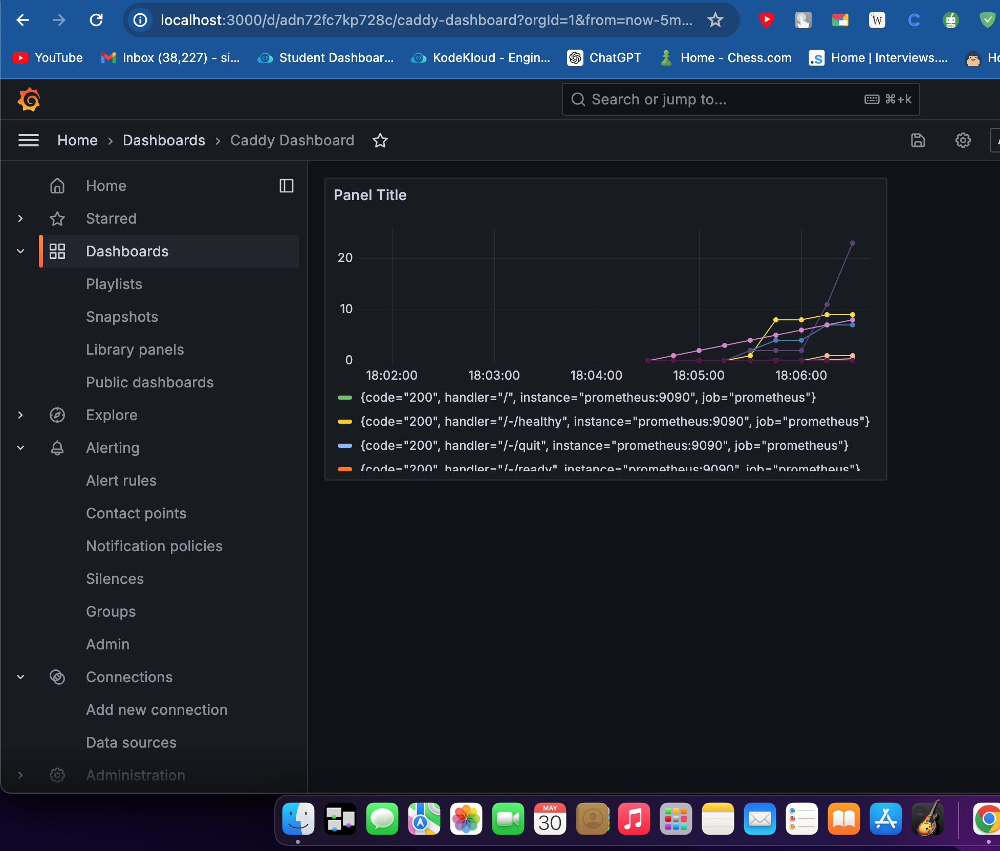
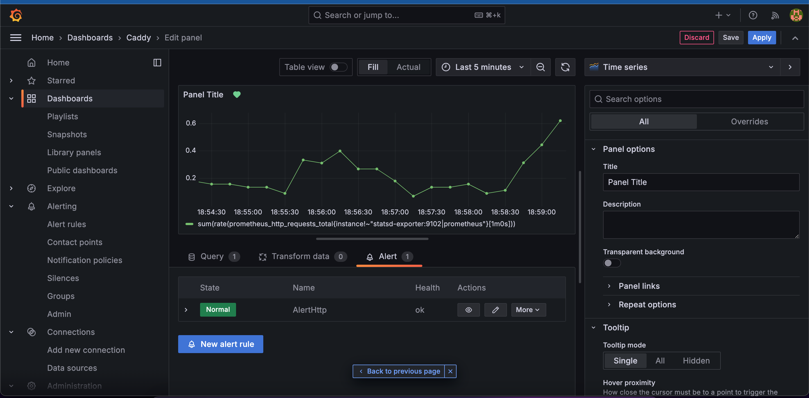
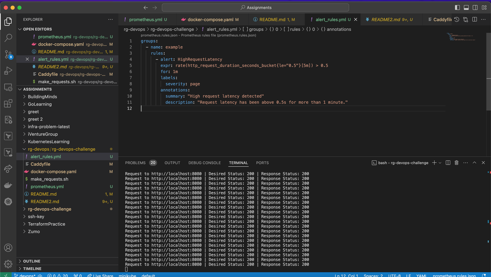

# Monitoring and Alerting System with Prometheus and Grafana

## Overview

This project sets up a monitoring and alerting system for a Dockerized environment using Prometheus and Grafana. The setup includes:

- **Caddy** as a reverse proxy.
- **Dummy HTTP Service** to simulate a web application.
- **Prometheus** for monitoring.
- **Grafana** for visualization.

## Table of Contents

- [Overview](#overview)
- [Configuration Steps](#configuration-steps)
  - [Docker Compose Setup](#docker-compose-setup)
  - [Prometheus Configuration](#prometheus-configuration)
  - [Grafana Configuration](#grafana-configuration)
  - [Caddy Configuration](#caddy-configuration)
- [Grafana Dashboards](#grafana-dashboards)
- [Alerting Rules](#alerting-rules)
- [Optional Improvements](#optional-improvements)
- [Usage of make_requests.sh](#usage-of-make_requests.sh)
- [Additional Notes](#additional-notes)

## Configuration Steps

### Docker Compose Setup

Create a `docker-compose.yml` file with the following content:

```yaml
version: '3'

services:
  http-dummy-service:
    container_name: http-dummy
    image: rgjcastrillon/http-dummy-service:0.1.0
    networks:
      - backend

  caddy:
    container_name: caddy
    image: caddy:latest
    ports:
      - "8080:80"
      - "2019:2019"
    networks:
      - backend
    volumes:
      - ./Caddyfile:/etc/caddy/Caddyfile:ro

  prometheus:
    container_name: prometheus
    image: prom/prometheus:latest
    ports:
      - "9090:9090"
    volumes:
      - ./prometheus.yml:/etc/prometheus/prometheus.yml
    networks:
      - backend

  grafana:
    container_name: grafana
    image: grafana/grafana:latest
    ports:
      - "3000:3000"
    environment:
      - GF_SECURITY_ADMIN_PASSWORD=admin
    volumes:
      - grafana-storage:/var/lib/grafana
    networks:
      - backend

networks:
  backend:

volumes:
  grafana-storage:
```

### Prometheus Configuration

Create a `prometheus.yml` configuration file:

```yaml
global:
  scrape_interval: 15s

scrape_configs:
  - job_name: 'prometheus'
    static_configs:
      - targets: ['prometheus:9090']

  - job_name: 'http-dummy-service'
    static_configs:
      - targets: ['http-dummy-service:8080']
```

### Grafana Configuration

1. Access Grafana at <http://localhost:3000> and log in with the default credentials (admin/admin).
2. Add Prometheus as a data source:

- Navigate to `Configuration` > `Data Sources` > `Add data source.`

- Select Prometheus.
- Set the URL to `http://prometheus:9090`.
- Click `Save & Test`.

### Caddy Configuration

Update the `Caddyfile` to include routes for Prometheus and Grafana:

```text
{
  servers {
    metrics
  }
}

:80 {
  reverse_proxy http-dummy-service:8080
}

:2019 {
  reverse_proxy /metrics prometheus:9090
}

:3000 {
  reverse_proxy grafana:3000
}
```

## Grafana Dashboards

Create a new dashboard in Grafana and add panels to visualize metrics from Prometheus. For example, you can create panels to monitor HTTP request rates and response codes from the dummy HTTP service.

### Example Dashboard

#### Panel 1 - HTTP Requests

1. Add a new panel.
2. Set the data source to **Prometheus**.
3. Use a Prometheus query like: `sum(rate(prometheus_http_requests_total{instance!~"statsd-exporter:9102|prometheus"}[$__rate_interval]))`
4. Configure visualization settings as needed.




#### Panel 2 - Caddy HTTP Requests

1. Add a new panel with name `Caddy HTTP Requests`
2. Set the data source to **Prometheus**.
3. Query: `sum(rate(caddy_http_requests_total[1m])) by (code)`
4. Visualization: Graph
5. Description: `Monitors the rate of HTTP requests handled by Caddy.`


## Alerting Rules

Add alerting rules to `prometheus.yml`:

```yaml
rule_files:
  - "alert_rules.yml"
```

Create an `alert_rules.yml` file:

```yaml
groups:
  - name: example
    rules:
      - alert: HighRequestLatency
        expr: rate(http_request_duration_seconds_bucket{le="0.5"}[5m]) > 0.5
        for: 1m
        labels:
          severity: page
        annotations:
          summary: "High request latency detected"
          description: "Request latency has been above 0.5s for more than 1 minute."
```


## Optional Improvements

- **Scalability**: Add more instances of the dummy HTTP service and load balance them using Caddy.
- **Security**: Secure Grafana with a stronger password and enable HTTPS for Caddy.
- **Persistence**: Ensure data persistence for Prometheus and Grafana by mapping volumes to host directories.

## Usage of make_requests.sh

The `make_requests.sh` script is used to generate traffic to the dummy HTTP service for testing purposes.

### make_requests.sh

```bash
#!/bin/bash

# Check if all required arguments are provided
if [ "$#" -ne 3 ]; then
    echo "Usage: $0 <URL> <desired_status> <sleep_time>"
    exit 1
fi

URL=$1
DESIRED_STATUS=$2
SLEEP_TIME=$3

# Function to make requests
make_request() {
    local response
    response=$(curl -s -o /dev/null -w "%{http_code}" "$URL?status=$DESIRED_STATUS")
    echo "Request to $URL | Desired Status: $DESIRED_STATUS | Response Status: $response"
}

# Loop to make requests
while true; do
    make_request
    sleep "$SLEEP_TIME"
done
```

### Usage

Make the script executable and run it:

```sh
chmod +x make_requests.sh
./make_requests.sh http://localhost:8080 200 0.5
```


## Additional Notes

- **Clean Up**: To stop and remove all containers and networks created by Docker Compose, use:

```sh
docker-compose down
```

- **Customization**: Modify configurations and scripts as needed to fit your specific requirements.
